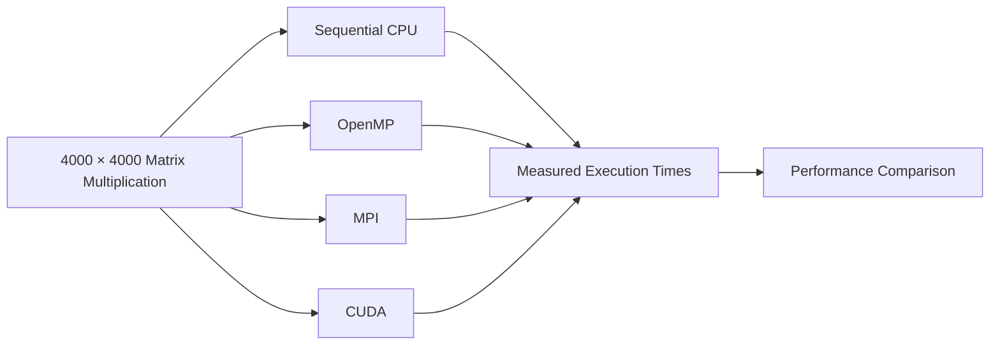

# PGC Experiment 1 — Parallel Matrix Multiplication

<p align="center">
  <strong>Sequential CPU | OpenMP | MPI | CUDA</strong><br>
  <em>A comparative study of matrix multiplication performance across sequential, shared-memory, distributed-memory, and GPU execution models.</em>
</p>

<p align="center">
  <a href="#experimental-overview">Overview</a> ·
  <a href="#objectives">Objectives</a> ·
  <a href="#technology-stack">Technology</a> ·
  <a href="#build-and-run">Build &amp; Run</a> ·
  <a href="#measured-execution-times">Results</a>
</p>

---

## Experimental Overview

This experiment evaluates the same **4000 × 4000 matrix multiplication** using four execution models: sequential CPU execution, OpenMP shared-memory parallelism, MPI distributed-memory execution, and CUDA GPU execution. Keeping the mathematical workload constant allows the measured execution times to be compared under different parallel computing models.

The core operation is:

$$
C_{ij}=\sum_{k=0}^{N-1}A_{ik}B_{kj}
$$

The dominant computational complexity is **O(N³)**.



| Implementation | Execution model | Parallelism approach |
|---|---|---|
| Sequential | Single CPU execution flow | No explicit parallelism |
| OpenMP | Shared-memory CPU | Multiple CPU threads |
| MPI | Distributed memory | Multiple processes across nodes |
| CUDA | GPU parallelism | GPU threads organized into blocks and grids |

## Objectives

1. Implement matrix multiplication using sequential execution.
2. Parallelize matrix multiplication using OpenMP.
3. Distribute matrix computation using MPI.
4. Implement GPU-based matrix multiplication using CUDA.
5. Measure execution time for each implementation.
6. Compare the performance of the four execution models.
7. Calculate speedup relative to the sequential baseline for verified implementations.
8. Evaluate computational performance together with output correctness.

---

## Technology Stack

| Area | Technology |
|---|---|
| Programming language | C / CUDA C |
| Sequential compiler | GCC |
| Shared-memory parallelism | OpenMP |
| Distributed-memory parallelism | Open MPI |
| GPU acceleration | NVIDIA CUDA Toolkit |
| CPU environment | Ubuntu / WSL2 |
| MPI environment | Ubuntu virtual machines + OpenSSH |
| GPU compiler | `nvcc` |
| Version control | Git / GitHub |

---

## Repository Structure

```text
PGC-Exp1-Parallel-Matrix-Multiplication-main/
│
├── README.md
│
├── src/
│   ├── matrix_sequential.c
│   ├── matrix_openmp.c
│   ├── matrix_mpi.c
│   └── matrix_cuda.c
│
└── screenshots/
    ├── sequential/
    │   └── sequential.jpg
    ├── OpenMp/
    │   └── openmp.jpg
    ├── Mpi/
    │   ├── 01.MPI.png
    │   ├── 02.MPI.png
    │   └── 10.MPIresults.png
    └── Cuda/
        ├── 1-Cuda.png
        └── 2-Cuda.png
```

### Source-code map

| File | Role | Main concept |
|---|---|---|
| `matrix_sequential.c` | Baseline implementation | Triple nested loop |
| `matrix_openmp.c` | CPU parallel implementation | `#pragma omp parallel for` |
| `matrix_mpi.c` | Distributed implementation | `Scatter → Broadcast → Compute → Gather` |
| `matrix_cuda.c` | GPU implementation | CUDA kernel with 2D grid/block mapping |

---

## Environment Setup

### WSL and Ubuntu

From Windows PowerShell:

```powershell
wsl --status
wsl -l -v
wsl
```

Inside Ubuntu:

```bash
sudo apt update
sudo apt install build-essential -y
gcc --version
```

### OpenMP

Check the available logical CPUs:

```bash
nproc
```

For the recorded repository run:

```bash
export OMP_NUM_THREADS=8
echo $OMP_NUM_THREADS
```

### MPI

The experiment uses four MPI processes distributed across a Master and three Worker nodes.

```text
                 Master — Rank 0
                       |
          +------------+------------+
          |            |            |
          v            v            v
     Worker 1      Worker 2      Worker 3
      Rank 1        Rank 2        Rank 3
```

Install OpenSSH and Open MPI on the participating Ubuntu nodes:

```bash
sudo apt update
sudo apt install openssh-server -y
sudo systemctl enable --now ssh
sudo apt install openmpi-bin libopenmpi-dev -y
```

Verify the installation:

```bash
mpicc --version
mpirun --version
```

### CUDA

Verify the NVIDIA driver and CUDA compiler:

```bash
nvidia-smi
nvcc --version
```

The recorded repository environment reports **CUDA compilation tools 13.4, compiler V13.4.92**.

---

## Build and Run

### Sequential

```bash
cd src
gcc -O2 matrix_sequential.c -o matrix_sequential
./matrix_sequential
```

### OpenMP

```bash
cd src
gcc -O2 -fopenmp matrix_openmp.c -o matrix_openmp
export OMP_NUM_THREADS=8
./matrix_openmp
```

### MPI

Compile on the Master node:

```bash
cd src
mpicc -O2 matrix_mpi.c -o matrix_mpi
```

After copying the executable to the participating Worker nodes and configuring the MPI hostfile, launch four processes:

```bash
mpirun -np 4 --hostfile hosts sh -c '$HOME/matrix_mpi'
```

The MPI implementation follows the communication sequence:

```text
Matrix A
   |
   +-- MPI_Scatter --> rows distributed among ranks

Matrix B
   |
   +-- MPI_Bcast ----> available to every rank

Each rank
   |
   +-- Local matrix multiplication

Partial C matrices
   |
   +-- MPI_Gather ---> complete C on Rank 0
```

### CUDA

```bash
cd src
nvcc -O2 matrix_cuda.cu -o matrix_cuda
./matrix_cuda
```

Recorded CUDA execution configuration:

| Parameter | Configuration |
|---|---|
| Matrix size | `4000 × 4000` |
| Block size | `16 × 16` threads |
| Grid size | `250 × 250` blocks |
| Threads per block | `256` |

---

## Results

## Measured Execution Times

| Implementation | Configuration | Execution time |
|---|---|---:|
| Sequential | 1 CPU execution flow | **721.508167 s** |
| OpenMP | 8 CPU threads | **634.089440 s** |
| MPI | 4 MPI processes | **102.444853 s** |
| CUDA | 250 × 250 blocks, 16 × 16 threads | **0.017623 s** total |

## Performance Comparison

Speedup is calculated relative to the measured sequential execution time:

$$
Speedup = \frac{T_{sequential}}{T_{implementation}}
$$

| Implementation | Execution time | Speedup vs Sequential | Performance observation |
|---|---:|---:|---|
| Sequential | **721.508167 s** | **1.00×** | Baseline execution |
| OpenMP | **634.089440 s** | **1.14×** | Modest improvement over baseline |
| MPI | **102.444853 s** | **7.04×** | Strongest verified improvement |
| CUDA | **0.017623 s** total | **Not validated** | Lowest recorded raw time; output requires verification |

## Conclusion

This experiment demonstrates how the same 4000 × 4000 matrix multiplication workload behaves under sequential CPU execution, OpenMP shared-memory parallelism, MPI distributed-memory execution, and CUDA GPU execution. The measured results show that OpenMP provides a modest improvement over the sequential baseline, while MPI achieves a substantially lower execution time through distributed computation across multiple processes.

The CUDA implementation records the lowest execution time in the measured runs. However, the recorded CUDA output did not produce the expected verification value, so its timing should be treated as an observed measurement rather than a validated performance result. Overall, the experiment highlights the performance trade-offs between shared-memory, distributed-memory, and GPU-based parallel computing while maintaining the same computational problem across all implementations.

---
## Author

**Rakshita L Kademani**

PGC Experiment 1 — Parallel Matrix Multiplication

<p align="center">
  <strong>PGC Experiment 1</strong><br>
  <em>Parallel Matrix Multiplication — Sequential | OpenMP | MPI | CUDA</em>
</p>
