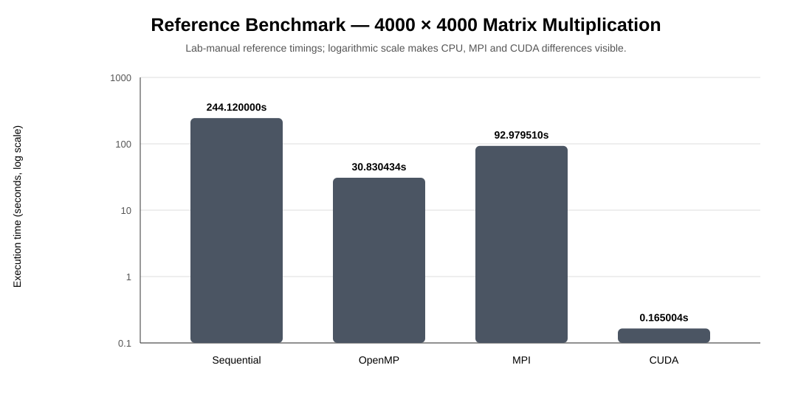
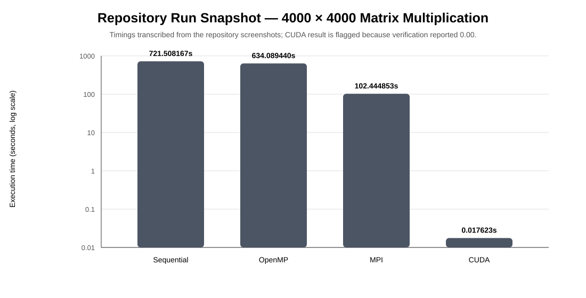
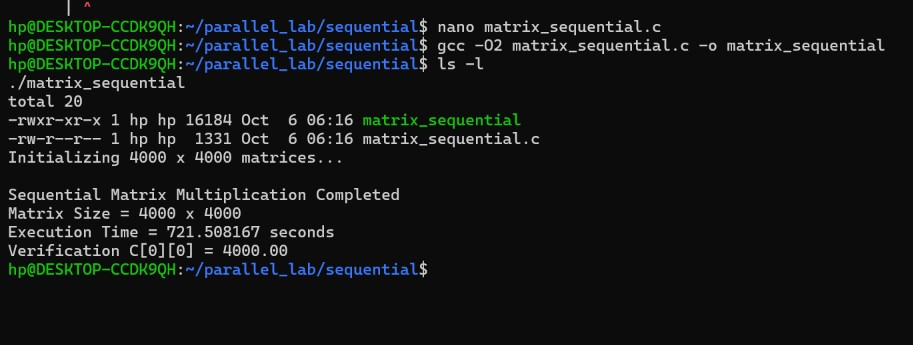
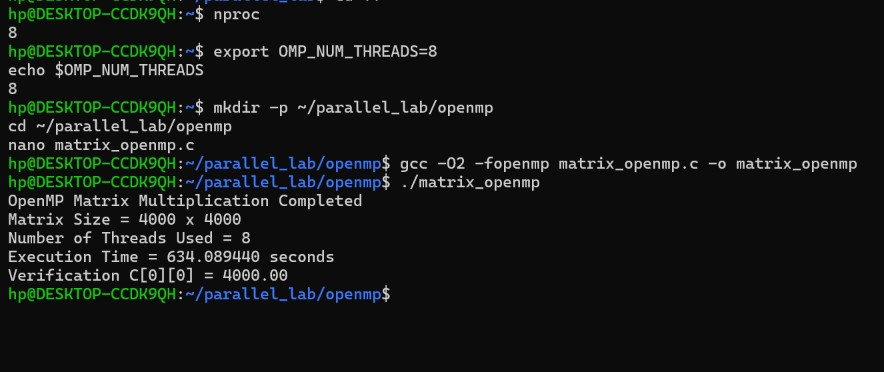
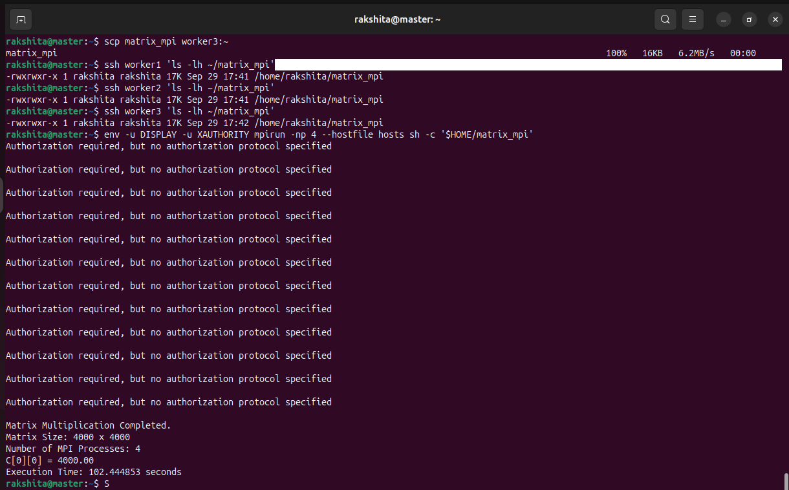
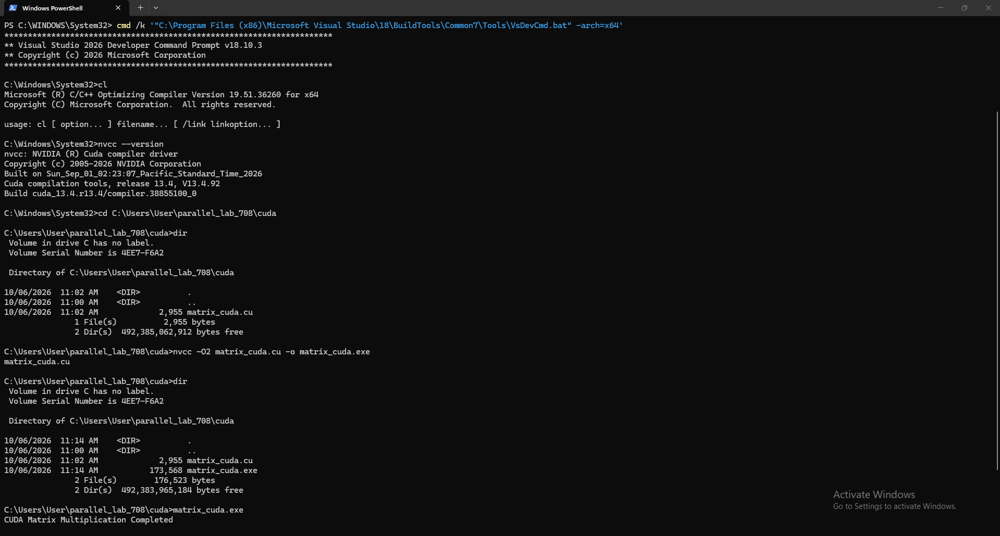
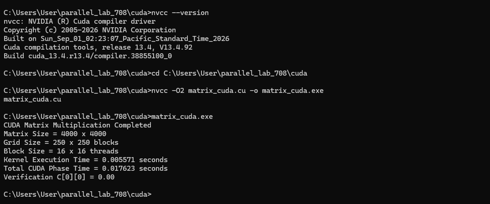

# PGC Experiment 1 — Parallel Matrix Multiplication

> **Parallel Computing Laboratory | Sequential CPU • OpenMP • MPI • CUDA**

A single mathematical workload is used as a controlled benchmark and executed through four different parallel-computing models. The purpose is not only to make matrix multiplication faster, but to observe **where the parallelism lives, how data moves, what overhead is introduced, and how the execution model changes performance**.

---

## 1. Experiment at a Glance

| Item | Configuration |
|---|---|
| Workload | Matrix multiplication `C = A × B` |
| Matrix size | `4000 × 4000` |
| Matrix values | `A[i][j] = 1.0`, `B[i][j] = 1.0` |
| Expected verification | `C[0][0] = 4000.00` |
| Baseline | Sequential CPU implementation |
| Shared-memory model | OpenMP |
| Distributed-memory model | MPI across 4 Ubuntu VMs |
| Accelerator model | CUDA on NVIDIA GPU |
| Main language | C / CUDA C |
| Compilation | GCC, `mpicc`, `nvcc` |

### The core idea

```text
                         4000 × 4000 Matrix Multiplication
                                      │
                    ┌─────────────────┴─────────────────┐
                    │                                   │
             Same mathematical work              Same verification
                    │                                   │
        ┌───────────┼───────────┬───────────┐           │
        ▼           ▼           ▼           ▼           ▼
   Sequential    OpenMP       MPI        CUDA       C[0][0]
   1 CPU flow   8 threads   4 VMs/ranks   GPU       = 4000.00
        │           │           │           │
        └───────────┴───────────┴───────────┘
                         │
                  Performance Study
```

The lab manual defines the workflow as **Sequential → OpenMP → MPI → CUDA → Results & Speedup Comparison**. It also states that the reference workload initializes both matrices with ones, making every output element 4000.00. 

---

## 2. Objectives

1. Implement the same matrix multiplication algorithm using four execution models.
2. Establish a sequential CPU implementation as the baseline.
3. Measure the effect of **thread-level parallelism** with OpenMP.
4. Measure the effect of **distributed-memory execution and communication** with MPI.
5. Measure GPU acceleration using CUDA kernels.
6. Compare execution time, speedup, resource model, and communication overhead.
7. Verify that the mathematical result remains consistent across implementations.

---

## 3. Computing Models Compared

| Model | Memory model | Parallel unit | Where work executes | Main strength | Main overhead |
|---|---|---|---|---|---|
| Sequential | Single address space | One CPU flow | One CPU execution flow | Simplicity / baseline | No parallelism |
| OpenMP | Shared memory | CPU threads | Multiple CPU cores | Low-cost shared-memory parallelism | Thread/runtime overhead |
| MPI | Distributed memory | Processes/ranks | Multiple VMs/nodes | Scales across separate machines | Network + communication overhead |
| CUDA | GPU memory + host memory | GPU threads | NVIDIA GPU | Massive data parallelism | Transfers + kernel launch + GPU dependency |

### Why four implementations?

This experiment keeps the **problem constant** and changes the **execution model**. That makes the comparison meaningful: the difference in observed performance is primarily a consequence of how the computation and data are mapped to hardware.

---

## 4. Repository Structure

```text
PGC-Exp1-Parallel-Matrix-Multiplication-main/
│
├── README.md
├── assets/
│   ├── reference-execution-time.svg
│   └── repository-execution-time.svg
│
├── src/
│   ├── matrix_sequential.c
│   ├── matrix_openmp.c
│   ├── matrix_mpi.c
│   └── matrix_cuda.c
│
└── screenshots/
    ├── sequential/
    │   └── sequential.jpg
    ├── OpenMp/
    │   └── openmp.jpg
    ├── Mpi/
    │   ├── 01.MPI.png
    │   ├── 02.MPI.png
    │   ├── ...
    │   └── 10.MPIresults.png
    └── Cuda/
        ├── 1-Cuda.png
        └── 2-Cuda.png
```

### Source-code map

| File | Purpose | Key mechanism |
|---|---|---|
| `matrix_sequential.c` | Baseline matrix multiplication | Triple nested loop |
| `matrix_openmp.c` | Shared-memory parallel version | `#pragma omp parallel for` |
| `matrix_mpi.c` | Distributed version | `MPI_Scatter`, `MPI_Bcast`, `MPI_Gather` |
| `matrix_cuda.c` | GPU version | CUDA kernel + 2D grid/block |

---

## 5. Algorithmic Foundation

All implementations retain the classical matrix multiplication structure:

\[
C_{ij} = \sum_{k=0}^{N-1} A_{ik}B_{kj}
\]

For `N = 4000`, the dominant computation is approximately:

\[
O(N^3) = O(4000^3)
\]

The parallel versions do **not** change the mathematical operation. They change how iterations are assigned to execution resources.

### Sequential

```text
for i = 0 ... N-1
    for j = 0 ... N-1
        for k = 0 ... N-1
            C[i][j] += A[i][k] × B[k][j]
```

### OpenMP

The outer `i` loop is distributed among multiple CPU threads:

```c
#pragma omp parallel for private(j, k)
for (i = 0; i < N; i++) {
    ...
}
```

### MPI

The rows of `A` are partitioned between ranks. Matrix `B` is broadcast, each rank computes its local result, and the partial matrices are gathered.

```text
A ──Scatter──► Rank 0 ─┐
       ├──────► Rank 1 │
       ├──────► Rank 2 ├── local computation ──► Gather ──► C
       └──────► Rank 3 │
B ──Broadcast──────────┘
```

### CUDA

Each GPU thread computes one output element conceptually:

```text
(row, col) = block/thread coordinates
C[row][col] = Σ A[row][k] × B[k][col]
```

The repository implementation uses a `16 × 16` block configuration.

---

## 6. Environment & Prerequisites

### CPU / Sequential / OpenMP

- Windows 10/11 host
- WSL2 with Ubuntu
- GCC / `build-essential`
- OpenMP support through GCC

Typical setup:

```bash
sudo apt update
sudo apt install build-essential -y
gcc --version
```

WSL verification from PowerShell:

```powershell
wsl --status
wsl -l -v
wsl
```

### MPI

- VMware Workstation or equivalent
- 4 Ubuntu VMs
- 1 Master + 3 Workers
- Same virtual network
- OpenSSH
- Open MPI

Install on each VM:

```bash
sudo apt update
sudo apt install openssh-server -y
sudo systemctl enable --now ssh
sudo apt install openmpi-bin libopenmpi-dev -y
```

Verify:

```bash
mpicc --version
mpirun --version
```

### CUDA

- NVIDIA CUDA-capable GPU
- NVIDIA driver
- CUDA Toolkit
- `nvcc`
- Sufficient GPU memory

Verify:

```bash
nvidia-smi
nvcc --version
```

The repository's CUDA screenshot records **CUDA Toolkit 13.4 / compiler 13.4.92**.

---

## 7. Build & Run

> The commands below mirror the source files in this repository and the workflow in the lab manual.

### 7.1 Sequential CPU

```bash
cd src
gcc -O2 matrix_sequential.c -o matrix_sequential
./matrix_sequential
```

Expected verification:

```text
Verification C[0][0] = 4000.00
```

---

### 7.2 OpenMP

Check available CPUs and choose the lab configuration:

```bash
nproc
export OMP_NUM_THREADS=8
echo $OMP_NUM_THREADS
```

Compile and execute:

```bash
gcc -O2 -fopenmp matrix_openmp.c -o matrix_openmp
./matrix_openmp
```

Expected output includes:

```text
Number of Threads Used = 8
Verification C[0][0] = 4000.00
```

Optional monitoring:

```bash
htop
```

---

### 7.3 MPI

Create a hostfile on the Master:

```text
master slots=1
worker1 slots=1
worker2 slots=1
worker3 slots=1
```

Compile:

```bash
mpicc -O2 matrix_mpi.c -o matrix_mpi
```

Copy the executable to workers:

```bash
scp matrix_mpi worker1:~/matrix_mpi
scp matrix_mpi worker2:~/matrix_mpi
scp matrix_mpi worker3:~/matrix_mpi
```

Run four processes:

```bash
mpirun -np 4 --hostfile hosts sh -c '$HOME/matrix_mpi'
```

The implementation distributes **1000 rows per rank** for a `4000 × 4000` matrix with four MPI processes.

---

### 7.4 CUDA

Compile:

```bash
nvcc -O2 matrix_cuda.c -o matrix_cuda
```

Run:

```bash
./matrix_cuda
```

The implementation uses:

| CUDA parameter | Configuration |
|---|---:|
| Matrix | `4000 × 4000` |
| Block | `16 × 16` |
| Threads per block | `256` |
| Grid | `250 × 250` |
| Total blocks | `62,500` |
| Logical thread instances | `16,000,000` |

Because `4000 / 16 = 250`, the grid is `250 × 250` blocks. The lab manual describes the logical threads as corresponding to the output elements of the `4000 × 4000` result matrix.

---

## 8. MPI Cluster Configuration

The reference lab configuration uses four nodes:

| Node | Hostname | Reference IP | Role |
|---|---|---|---|
| Master | `master` | `192.168.125.128` | Rank 0 |
| Worker 1 | `worker1` | `192.168.125.129` | Rank 1 |
| Worker 2 | `worker2` | `192.168.125.130` | Rank 2 |
| Worker 3 | `worker3` | `192.168.125.131` | Rank 3 |

> IP addresses are environment-specific. Treat the values above as the lab-manual reference configuration, not universal addresses.

### SSH validation

```bash
ssh-copy-id worker1
ssh-copy-id worker2
ssh-copy-id worker3

ssh worker1 hostname
ssh worker2 hostname
ssh worker3 hostname
```

---

## 9. Performance Results

### 9.1 Lab-manual reference benchmark

The lab manual records the following benchmark for the same `4000 × 4000` workload:

| Implementation | Execution model | Resources | Time (s) | Speedup | Verification |
|---|---|---|---:|---:|---:|
| Sequential | Single CPU execution | 1 CPU flow | 244.120000 | 1.00× | 4000.00 |
| OpenMP | Shared memory | 8 CPU threads | 30.830434 | 7.92× | 4000.00 |
| MPI | Distributed memory | 4 processes / 4 VMs | 92.979510 | 2.63× | 4000.00 |
| CUDA | GPU parallelism | NVIDIA RTX 4500 Ada | 0.165004 | 1479.48× | 4000.00 |

**Speedup formula**

\[
Speedup = \frac{T_{sequential}}{T_{parallel}}
\]



### What the reference benchmark shows

- **Sequential** is the baseline.
- **OpenMP** benefits from multiple CPU threads while retaining a shared address space.
- **MPI** parallelizes across separate processes and VMs, but communication contributes additional cost.
- **CUDA** achieves the highest measured acceleration for this workload because a very large number of GPU threads can execute the data-parallel computation.

---

## 10. Repository Screenshot Results — Important Distinction

The screenshots committed to this repository show a **different run** from the benchmark values printed in the lab manual. For transparency, the repository evidence is preserved below rather than silently replacing it with the manual's values.

| Implementation | Screenshot timing | Verification shown | Status |
|---|---:|---:|---|
| Sequential | **721.508167 s** | `4000.00` | Valid result |
| OpenMP | **634.089440 s** | `4000.00` | Valid result |
| MPI | **102.444853 s** | `4000.00` | Valid result |
| CUDA | **0.017623 s** total | `0.00` | **Verification issue — do not treat speedup as validated** |



### Why this distinction matters

A benchmark should only be compared as a valid performance result when the computation is also verified. The repository's CUDA screenshot reports an extremely low time but also reports `C[0][0] = 0.00`, while the expected mathematical result is `4000.00`. Therefore, the README intentionally **does not claim a valid CUDA speedup from that screenshot**.

This is a stronger and more reproducible reporting practice than presenting every measured number as automatically correct.

---

## 11. Result Screenshots

### Sequential CPU



The repository screenshot shows the `4000 × 4000` sequential execution completing with `C[0][0] = 4000.00`.

### OpenMP



The screenshot records 8 OpenMP threads and a verified result of `4000.00`.

### MPI

The MPI folder contains the complete cluster setup and execution trail, including host configuration, SSH, executable transfer and final execution output.



The final screenshot records 4 MPI processes, `102.444853` seconds, and `C[0][0] = 4000.00`. It also visibly shows repeated `Authorization required` messages during the run; these should be treated as environment/display warnings rather than ignored when reproducing the setup.

### CUDA





The repository CUDA screenshot confirms compilation and execution with a `250 × 250` grid and `16 × 16` blocks, but the displayed verification is `0.00`. This needs to be investigated before using that timing for a final performance claim.

---

## 12. Performance Interpretation

### 12.1 Why OpenMP may outperform Sequential

OpenMP partitions iterations of the outer loop among CPU threads. Multiple cores therefore perform independent rows of the output concurrently while sharing the same process memory.

### 12.2 Why MPI can be slower than OpenMP

MPI processes have separate address spaces. The experiment therefore needs communication operations such as:

- `MPI_Scatter` — distribute rows of `A`.
- `MPI_Bcast` — distribute `B` to every rank.
- Local computation — each rank computes its assigned rows.
- `MPI_Gather` — collect partial `C` matrices.

The computation is parallel, but communication and VM networking introduce additional work.

### 12.3 Why CUDA can be dramatically faster

Matrix multiplication contains a large number of independent output-element calculations. CUDA maps these calculations to many GPU threads, using a grid of blocks. The lab configuration uses `250 × 250` blocks with `16 × 16` threads per block.

However, **GPU speed alone is not enough**. The output must be correct. The repository's current CUDA screenshot therefore requires verification before the run can be considered a valid benchmark.

---

## 13. Comparison Matrix

| Criterion | Sequential | OpenMP | MPI | CUDA |
|---|---|---|---|---|
| Programming complexity | Low | Low–Medium | Medium–High | Medium–High |
| Memory model | Shared | Shared | Distributed | Host + GPU |
| Communication | None | Low | High | Host/device transfers |
| Scaling target | One CPU flow | Multi-core CPU | Multi-node / multi-process | GPU |
| Main API/mechanism | C loops | OpenMP pragma | MPI API | CUDA kernel API |
| Typical best fit | Baseline / simple workloads | CPU parallel workloads | Cluster workloads | Highly data-parallel workloads |
| Experiment role | Baseline | Shared-memory comparison | Distributed-memory comparison | Accelerator comparison |

---

## 14. Troubleshooting

| Problem | Check / Fix |
|---|---|
| `wsl` not found | Verify WSL from PowerShell with `wsl --status`. |
| Ubuntu does not start | Try `wsl --shutdown`, then launch WSL again. |
| `gcc` not found | Install `build-essential`. |
| OpenMP compile error | Ensure `-fopenmp` is present. |
| OpenMP uses fewer threads | Check `nproc` and `echo $OMP_NUM_THREADS`. |
| MPI ping fails | Confirm all VMs use the same virtual network and verify IP addresses. |
| SSH asks for password | Run `ssh-copy-id` from Master to each Worker and retest. |
| MPI cannot launch workers | Check hostfile names, SSH access and executable placement. |
| `nvidia-smi` fails | Check NVIDIA driver/GPU visibility. |
| `nvcc` not found | Check CUDA Toolkit installation and PATH. |
| CUDA verification is `0.00` | Treat the run as invalid until CUDA errors, kernel execution and device-memory transfers are checked. |

---

## 15. Key Takeaways

1. **Parallelism is an execution strategy, not a change to the mathematical problem.**
2. **OpenMP** demonstrates shared-memory CPU parallelism with relatively little code change.
3. **MPI** demonstrates distributed memory and makes communication overhead visible.
4. **CUDA** demonstrates fine-grained GPU parallelism and requires explicit host/device data movement.
5. A fair benchmark requires both **performance measurement and correctness verification**.
6. The same workload can behave very differently depending on the hardware and execution model.
7. The repository preserves both the implementation evidence and the measured screenshots so the experiment remains reproducible and auditable.

---

## 16. Conclusion

This experiment uses one `4000 × 4000` matrix multiplication problem to expose four different approaches to parallel computing: sequential CPU execution, OpenMP shared-memory parallelism, MPI distributed-memory execution, and CUDA GPU acceleration.

The lab-manual reference benchmark demonstrates the potential performance gap between the models, with CUDA producing the largest measured acceleration and OpenMP providing substantial CPU-side improvement. The repository screenshots, however, contain different run times and reveal an important experimental lesson: **a faster number is not automatically a valid result**. In the current repository run, the CUDA timing is extremely small but the verification value is `0.00`, so it should not be treated as a confirmed speedup until correctness is restored.

That distinction makes this repository more than a collection of four implementations: it is a comparison of **computation, memory, communication, acceleration, and experimental validity**.

---

